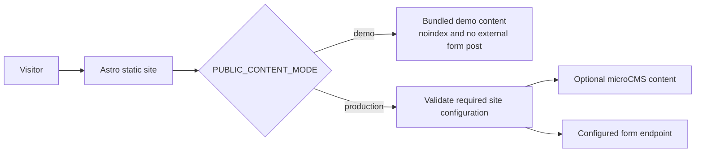

# Harmony Music School

> A production-minded Astro reference implementation for a small service business — designed to make demo content, forms, and release quality explicit.

音楽教室向けのAstroサイトです。ピアノ、ギター、バイオリン、声楽の個人レッスンと、有料体験レッスンの申込導線を扱います。

Astro 4 / Tailwind CSS / Vitest / Playwrightで構成し、Cloudflare Pagesへの静的デプロイを想定しています。

## Why this project matters

Web制作のデモを実在の事業情報のように見せず、公開時に壊れやすい箇所をあらかじめ検証できるように設計しています。

- **Demo safety:** 架空の講師・住所・実績を表示せず、デモモードでは`noindex,nofollow`とフォーム送信の明示を徹底します。
- **Release readiness:** 本番モードでは公開URL、連絡先、講師情報、フォーム送信先などが不足するとビルドを停止します。
- **Verification:** Vitest、Playwright E2E / accessibility / link / responsive / visual checks、Lighthouse CIを用途ごとに分けています。Pull Requestと`main`へのpushでは、typecheck・unit test・build・主要導線・a11y・リンク整合性のbrowser checksをGitHub Actionsで検証します。

## Architecture



## セットアップ

Node.js 20以上を使用してください。

```bash
npm install
copy .env.example .env
npm run dev
```

開発サーバーは通常 `http://localhost:4321` で起動します。

## デモモードと本番モード

初期値は `PUBLIC_CONTENT_MODE=demo` です。デモモードでは次の安全策が有効になります。

- フッターにデモ注記を集約し、全ページを `noindex,nofollow` にする
- 架空の講師、住所、連絡先、実績を表示しない
- フォーム送信先がない場合は「送信されません」と明示し、成功扱いにしない
- ブログはリポジトリ内のサンプル記事だけで静的生成し、外部CMSへ接続しない

本番化する場合は `.env` を次のように設定し、[src/data/site.ts](./src/data/site.ts) に確認済みの教室情報、講師、料金を設定してください。

```env
PUBLIC_CONTENT_MODE=production
PUBLIC_SITE_URL=https://example.com
PUBLIC_SITE_NAME=Harmony Music School
PUBLIC_FORM_ENDPOINT=https://example.com/api/forms
```

本番モードでは、HTTPSの公開URL、フォーム送信先、連絡先、講師が不足しているとビルドを停止します。プライバシーポリシーと料金条件も実際の運用に合わせて確認してください。

## フォームAPI

`/trial` と `/contact` は `PUBLIC_FORM_ENDPOINT` へJSONをPOSTします。HTTP 2xxが返った場合だけ完了表示になります。

```json
{
  "type": "trial",
  "name": "山田 花子",
  "email": "hanako@example.com",
  "instrument": "piano",
  "privacy": "on"
}
```

`type` は `trial` または `contact` です。既存のフォームfield名をそのまま送ります。API側では入力値の再検証、レート制限、スパム対策、適切なCORS設定を行ってください。

## ブログ

デモ用ブログは [src/data/blog.ts](./src/data/blog.ts) の4記事を静的生成します。権利記録のない旧アイキャッチは表示せず、記事を追加するときはローカル画像と出典記録をセットで登録してください。

## 写真とライセンス

- 編集写真は `src/assets/images/editorial/` に置き、[src/data/images.ts](./src/data/images.ts) でalt、焦点位置、出典を管理します。
- `EditorialImage` コンポーネントがAVIF / WebP / JPEG、responsive widths、画像領域の確保、lazy loadingを担当します。
- ストック写真は必ず「イメージ」と明記し、実際の教室・講師・生徒として扱いません。
- 素材ページ、撮影者、取得日、ライセンス、加工履歴は [IMAGE_LICENSES.md](./IMAGE_LICENSES.md) に記録します。
- 実写へ差し替える場合は、成人または未成年者の保護者からWeb掲載範囲・期限・撤回窓口を含む同意を記録してください。

## デザインシステム

- Semantic Color Tokenの正本: [src/styles/global.css](./src/styles/global.css)
- Tailwindとの接続: [tailwind.config.js](./tailwind.config.js)
- 教室・コース・料金: [src/data/site.ts](./src/data/site.ts)
- 編集画像とfocal point: [src/data/images.ts](./src/data/images.ts)
- サンプルブログ: [src/data/blog.ts](./src/data/blog.ts)
- UI primitive: `src/components/ui/`
- FAQ / Blog component: `src/components/content/`, `src/components/blog/`

本文はNoto Sans JP系、見出しはNoto Serif JP系のシステムフォントスタックを使用し、外部フォント読み込みによる表示遅延を避けます。Primary CTAは短い「体験レッスンを申し込む」を基本とし、料金は判断材料の近くで税込総額を表示します。

## テストとビルド

```bash
npm test
npm run build
npx playwright install chromium
npm run test:e2e
npm run test:a11y
npm run test:visual
npm run test:lighthouse
```

Visual Regressionの基準画像を意図的に更新する場合だけ、次を実行します。

```bash
npm run test:visual:update
```

Visual Regressionは360、390、768、1024、1280、1440pxで主要ページとブログ記事を確認します。ローカルの最適化画像も比較対象となるため、被写体のcrop、画像読み込み、キャプションを差分レビューしてください。

Lighthouse CIはビルド後のトップ、レッスン、体験ページをモバイル条件で3回計測します。デモの意図的な`noindex`はSEO失敗として扱わず、Performance 90、Accessibility / Best Practices 95を基準にします。

## 主なページ

| パス | 内容 |
| --- | --- |
| `/` | トップ |
| `/about` | 教室方針・講師 |
| `/lessons` | 4コース |
| `/pricing` | 体験・月額料金 |
| `/trial` | 体験申込 |
| `/contact` | 一般問い合わせ |
| `/faq` | よくある質問 |
| `/access` | 教室情報・地図 |
| `/blog` | ブログ |
| `/privacy` | プライバシーポリシー |

## デプロイ

Cloudflare PagesではBuild commandを `npm run build`、Output directoryを `dist` に設定し、上記の本番環境変数を登録してください。`PUBLIC_SITE_URL` はcanonical、sitemap、robots、OG URLの基準になります。
